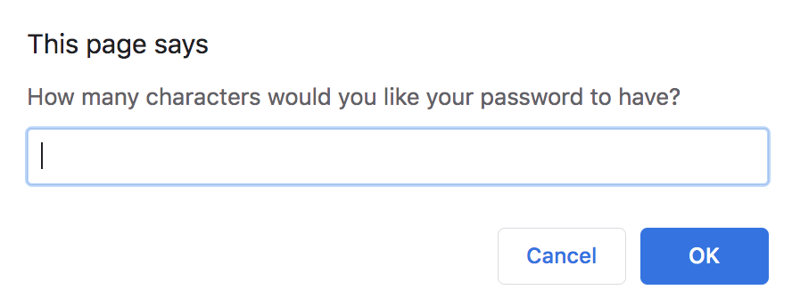
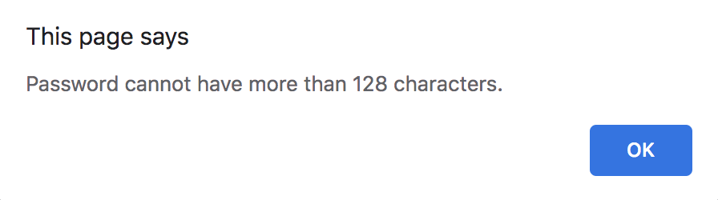
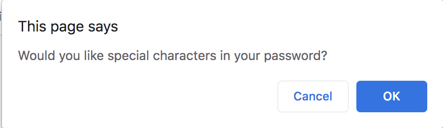
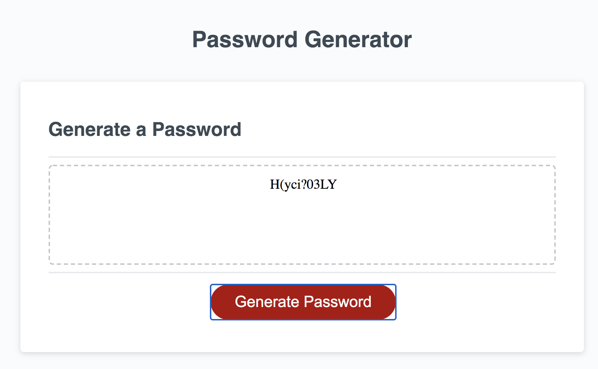
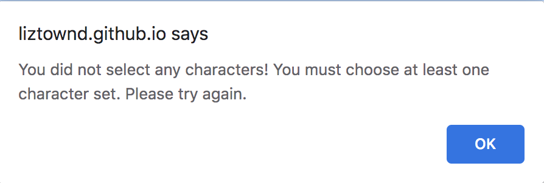

# password-generator

Javascript coded random password generator! 

Through a series of pop up alerts, the user sets parameters for their password then the script generates a random password using their input. The first alert asks the user to choose the length of their password:

If the number chosen is less than 8 or higher than 128 an alert will advise the user and they can try again (the prompt reappears):

From there, the user selects parameters for their password, such as including special characters, lower case letters, upper case letters, and/or numerals (they can choose any combination of the above):

The final result:

If the user cancels out of selecting ALL character sets, they will get an error message asking them to try again (they must select at least one character set to pull from):

 

#The Code:

Using Javascript, I set variables for each of the prompts and alerts, setting an array for each of the character options. When a character set is chosen (i.e. lower case letters) that array is added to a "compilation" array using the `push` method. This array is then randomized using the `Math.random` function, outputting a password of the specified length.

The deployed application can be found at <a href = "http://liztownd.github.io/password-generator>"> liztownd.github.io/password-generator </a>

